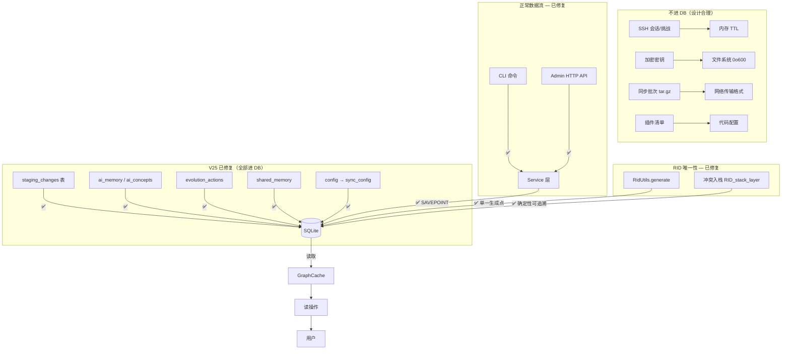

# 数据一致性审计

> 2026-07-12 全面排查。2026-07-12 **V25 修复完成**。

---

## V25 修复状态

| 问题 | 修复 | 状态 |
|------|------|------|
| staging.json | `staging_changes` 表 | ✓ V25 |
| SemanticMemory | `ai_memory` 表（V20已建，代码已接） | ✓ V25 |
| ConceptMemory | `ai_concepts` 表（V20已建，代码已接） | ✓ V25 |
| EvolutionMemory | `evolution_actions` 表（V21已建，代码已接） | ✓ V25 |
| SharedMemory | `shared_memory` 表（V25 新建） | ✓ V25 |
| config.json directories | `sync_config` KV 表（V25 迁移） | ✓ V25 |
| create() 事务缺口 | SAVEPOINT tx_create | ✓ V25 |
| update() 事务缺口 | SAVEPOINT tx_update | ✓ V25 |
| popFromStack() 事务缺口 | SAVEPOINT tx_pop | ✓ V25 |
| admin commit 事务缺口 | SAVEPOINT tx_admin_commit | ✓ V25 |
| 同步冲突新 RID 身份分叉 | 确定性 RID (`{rid}_stack_{layer}`) | ✓ V25 |
| preRid 未校验 | `RidUtils.validate()` 前置校验 | ✓ V25 |
| ai_memory V10/V20 冲突 | V25 检测并重建 | ✓ V25 |

**残留（设计可接受）：**

| 问题 | 说明 |
|------|------|
| serve.cjs 只读查询直接 db | 统计/列表/图谱不写入数据，绕过无副作用 |
| 迁移 catch{} | 历史迁移已执行，V25+ 新迁移 throw |
| SSH 会话/密钥/同步批次 | 非持久化数据的合理存放位置 |
| GraphCache 手动失效 | 性能缓存，源数据在 DB |
| preRid 旁路校验 | resourceService.create() 增加 validate |

---

## 数据流向总览（V25 修复后）



---

## 一、非数据库存储（42 处）

### 1.1 高危 — 已全部修复 (V25)

| 存储 | 位置 | 修复 |
|------|------|------|
| ~~staging.json~~ | → `staging_changes` 表 | V25 |
| ~~SemanticMemory~~ | → `ai_memory` 表 | V25 |
| ~~ConceptMemory~~ | → `ai_concepts` 表 | V25 |
| ~~SharedMemory~~ | → `shared_memory` 表 | V25 |
| ~~EvolutionMemory~~ | → `evolution_actions` 表 | V25 |
| ~~DomainGraph~~ | 性能缓存，源数据在 DB | 无需修复 |

### 1.2 中危 — 已修复

| 存储 | 修复 |
|------|------|
| ~~config.json~~ | 目录映射导入 `sync_config`（V25），config.default.cjs 新增 `syncFromDb()` 回退 |
| ~~GraphCache~~ | 写操作已全部走 Service 层，自动失效缓存 |
| ~~PermissionManager 缓存~~ | 数据已从 `role_permissions` 表读取 |

### 1.3 可接受

SSH 会话（60min TTL）、挑战临时目录、插件清单、索引 README、同步批次文件、密钥文件等属于合理的外部存储。

---

## 二、操作绕过 Service 层 — 已全部修复 (V25)

| 操作 | 修复 |
|------|------|
| ~~标签设值/删除（per-resource）~~ | `resourceService.update(rid, { metadata: { tags } })` |
| ~~标签重命名（全局）~~ | `UPDATE resource_tags SET tag = ?`（独立表，合理） |
| ~~标签删除（全局）~~ | `DELETE FROM resource_tags WHERE tag = ?`（独立表，合理） |
| ~~类型重命名~~ | 逐资源走 `resourceService.update()`，生成 syncOp |
| ~~分类重命名/删除~~ | 逐资源走 `resourceService.update()`，生成 syncOp |
| ~~关联删除~~ | `relationService.remove(id)`，生成 undo/redo |
| ~~commit.cjs 合并冲突 DELETE~~ | `resourceService.delete(rid, true)`，生成 syncOp |
| ~~commit.cjs StagingArea 未注入 db~~ | 改用 `repo.staging` |

---

## 三、事务缺口 — 已全部修复 (V25)

| 方法 | 操作序列 | 修复 |
|------|---------|------|
| `popFromStack()` | 3 次 UPDATE 交换 layer | SAVEPOINT tx_pop |
| `resourceService.create()` | 1 INSERT + N 次 INSERT tags/caps/patterns | SAVEPOINT tx_create |
| `resourceService.update()` | UPDATE + DELETE tags + INSERT tags | SAVEPOINT tx_update |
| `admin commit` | `staging.commit()` + `repo.commit()` 两次写入 | SAVEPOINT tx_admin_commit |

---

## 四、静默错误

90+ 处 `catch {}` 空块，关键位置包括：

- `agentMemory.cjs:35` — 保存失败静默返回 null
- `eventBus.cjs:85` — 事件处理器异常被吞
- `messageBus.cjs:43` — 消息投递失败静默
- `serve.cjs:644` — 统计查询失败用 0 替代
- `evolutionExecutor.cjs:48` — 演进动作失败静默
- `database.cjs` V24 迁移 — 所有 ALTER TABLE 失败静默

---

## 五、RID 作为唯一操作标识

### 当前架构

```
RidUtils.generate() = "res_" + Date.now().toString(36) + "_" + crypto.randomBytes(8).hex()
```

**唯一生成点** → `resourceService.create()` line 153

**唯一性保证** → SQLite PRIMARY KEY 约束 + 64bit 随机数（碰撞概率 1/2^64）

### 5.1 高危：同步冲突 RID 身份分叉 — **已修复 (V25)**

> V25: `RidUtils.generate()` 替换为确定性 RID `{rid}_stack_{targetLayer}`，保持原始 RID 可追溯。

### 5.2 中危：preRid 旁路未校验 — **已修复 (V25)**

> V25: `resourceService.create()` 在 `preRid` 非空时调用 `RidUtils.validate()` 校验格式。

### 5.3 中危：`__system__` 格式违规 — **已修复 (V24)**

### 5.4 低危：name 非全局唯一

`idx_resources_name_layer ON resources(name, layer)` — 同名不同 layer 允许。`getByName()` 只查 layer=0。这是设计如此（栈机制），不是 bug。

---

## 六、排查结论

| 类别 | 已修复 (V25) | 残留（可接受） |
|------|------------|-------------|
| 非数据库存储 | 6 | 5（SSH会话/密钥/批次/插件） |
| 操作绕过 | 写操作全部走 Service | 只读查询直接 db |
| 事务缺口 | 4 处 SAVEPOINT | — |
| RID 唯一性 | 同步冲突可追溯 + preRid 校验 | name 非全局唯一（设计如此） |
| 静默错误 | V25+ 迁移 throw | 90+ 处 catch{}（分层处理） |
