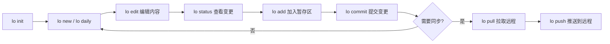

## 日常工作流

本文档描述使用 lo 进行知识管理的完整日常流程。

### 工作流全景



### 第一阶段：初始化仓库

```bash
# 创建笔记目录并初始化 lo 仓库（默认明文）
mkdir ~/my-notes
cd ~/my-notes
lo init

# 可选：需要全仓库加密时
lo init --encrypt

# （推荐）如果需要加密密钥保护
ssh-keygen -t ed25519 -C "lo-notes"   # 如果没有 SSH 密钥
lo auth add -k ~/.ssh/id_ed25519 -l "我的电脑"
```

> 默认明文模式，文件可直接编辑。笔记写好后如需加密，用 `lo encrypt <rid>` 或 `lo encrypt --all` 随时加密。

### 第二阶段：创建内容

**创建普通笔记：**

```bash
# 基本创建
lo new "React 状态管理最佳实践"

# 带标签和分类
lo new "Python 爬虫技巧" --tags "Python,爬虫" --category "编程/Python/爬虫"

# 使用模板
lo new "周会记录" --template meeting
```

**创建日记：**

```bash
lo daily
```

日记会自动使用日记模板，归入"日记"分类并添加"daily"标签。同一天多次执行不会重复创建。

**导入外部文件：**

```bash
# 导入 Markdown 文件
lo import ~/Documents/一篇老笔记.md

# 导入图片
lo import ~/Pictures/screenshot.png

# 导入 PDF
lo import ~/Papers/paper.pdf
```

### 第三阶段：编辑与组织

**编辑笔记：**

```bash
# 用默认编辑器打开
lo edit res_xxx

# 用指定编辑器
lo edit res_xxx --editor code
```

编辑器中直接修改内容，保存后关闭即可。

**添加标签和分类：**

```bash
lo tag add res_xxx 前端
lo tag add res_xxx 性能优化
lo category set res_xxx 编程/JavaScript
```

**建立链接：**

在笔记中使用 wikilink 语法建立双向链接：

```markdown
# React 基础
学习 [[res_yyy|React Hooks]] 之前需要先掌握基础概念。
```

运行 `lo sync` 后自动建立双向链接关系。

### 第四阶段：暂存与提交

```bash
# 查看当前变更状态
lo status

# 查看变更详情
lo diff

# 将文件加入暂存区
lo add resources/2026-07-05-li-jie-bi-bao.md
# 或暂存所有变更
lo add .

# 暂存标签/分类变更
lo tag add res_xxx 待复习
lo category set res_xxx 读书笔记

# 提交
lo commit -m "完成 React 笔记，添加标签"

# 查看提交历史
lo log
```

> 与 Git 类似，`lo status` 和 `lo diff` 不会修改任何数据，仅做检测报告。只有 `lo commit` 才会将变更写入数据库。

### 第五阶段：远程同步

```bash
# 注册远程地址（只需一次）
lo remote add my-server user@your-server:/data/lo-notes

# 开始工作前：拉取最新变更
lo pull my-server

# ... 本地工作（编辑、提交）...

# 结束工作前：推送变更
lo push my-server
```

**推荐节奏：**

- 每天开始工作前执行 `lo pull`
- 每天结束工作前执行 `lo push`
- 也可以配置 cron 每小时自动 push

**定时自动推送示例：**

```bash
# crontab 配置
0 9,22 * * * cd ~/my-notes && lo push my-server >> ~/logs/lo-sync.log 2>&1
```

### 完整示例：一天的工作流

```bash
# ===== 上午 9:00 开始工作 =====
cd ~/my-notes
lo pull my-server                # 拉取昨晚家用电脑的变更

# 创建今日日记
lo daily

# 写几篇笔记
lo new "微服务架构设计"
lo new "Kubernetes 部署实践" --tags "K8s,运维" --category "技术/云原生"

# 编辑已有笔记
lo edit res_xxx

# ===== 下午 5:00 工作收尾 =====
lo status                        # 查看今日全部变更

# 审查变更后提交
lo add .
lo commit -m "完成微服务和 K8s 笔记"

# 推送到远程
lo push my-server

# ===== 晚上在家 =====
cd ~/notes
lo pull my-server                # 拉取白天办公电脑的变更
# 继续编辑...
lo push my-server
```

### 最佳实践

1. **同一笔记避免在多台设备同时编辑** —— 写完 push，另一台 pull 后再编辑，避免冲突。
2. **定期 push，不要攒太久** —— 操作日志越积越多，push 时间会变长，也增加了冲突概率。
3. **养成先 pull 再 push 的习惯** —— 类似 Git，先获取别人的变更再推送自己的。
4. **善用 status 和 diff** —— commit 之前先审查变更，确保只提交需要的内容。
5. **定期 `lo sync --wikilinks`** —— 如果修改了大量笔记标题，执行全量 wikilink 重建以确保链接一致性。

### 相关文档

- [快速上手](getting-started.md) — 从零开始的初始化流程
- [版本控制](../core/version.md) — 暂存区与提交的详细说明
- [远程同步](../core/sync.md) — push/pull/clone 详解
- [笔记系统](../core/resource-model.md) — 笔记、标签、分类的完整操作
